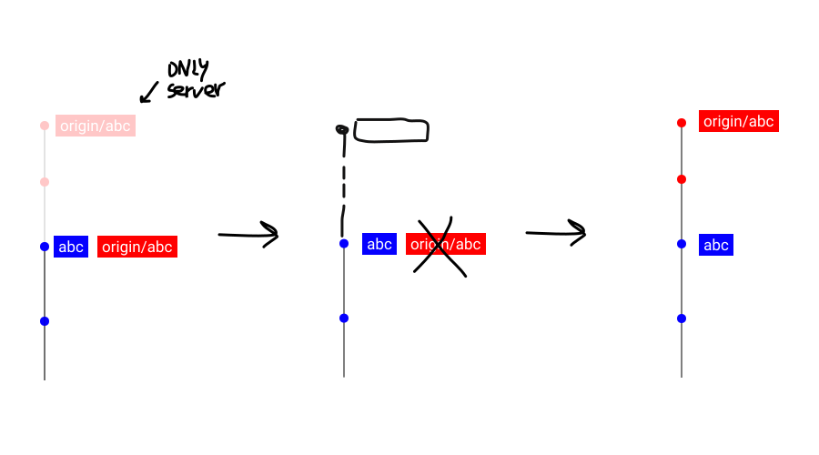
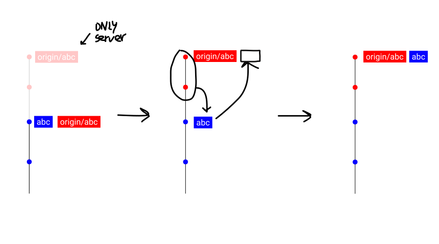
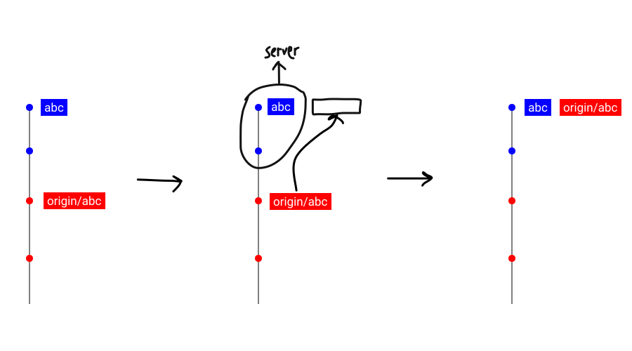
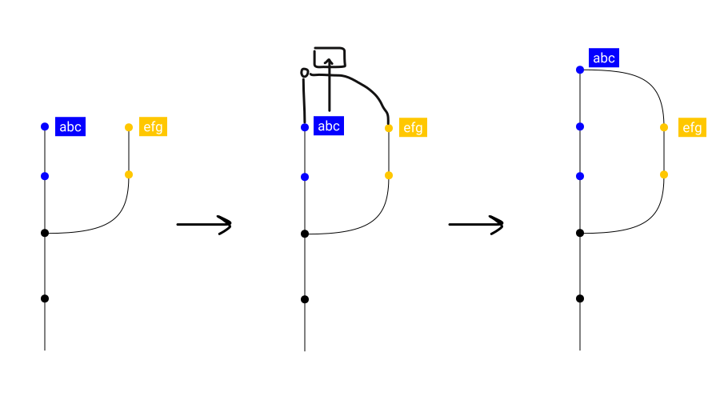
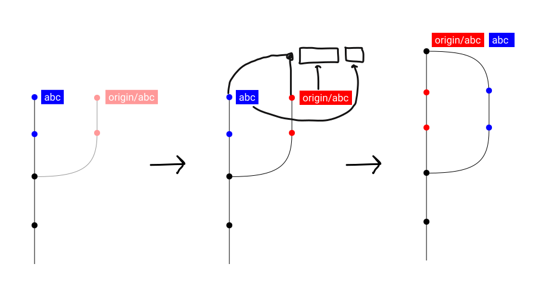
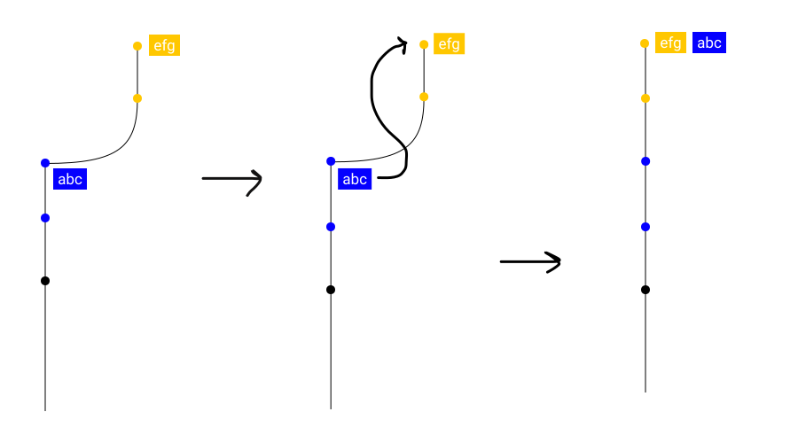
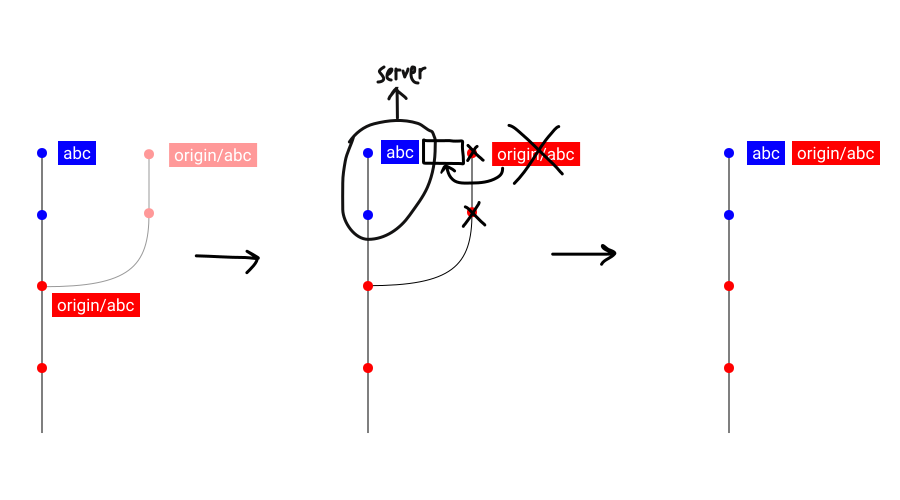
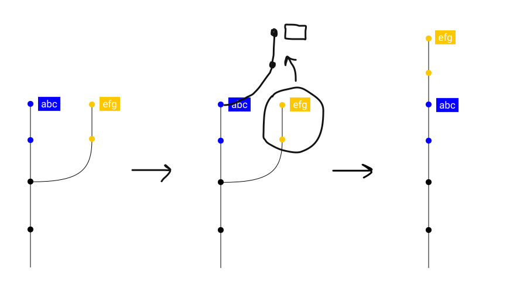
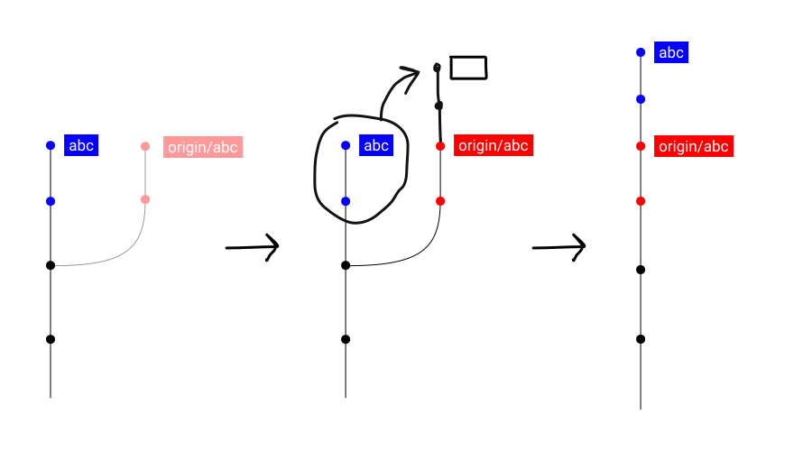

# GIT

This is a very simplified GIT guide, meaningful for those who work in Accurat, including both technical information and best practices.

In the intention of explaining **why** every action is done, every image depicts three phases: the BEFORE state, the developer's INTENTION, and the AFTER state.

For every operation some useful terminal commands are included, not because we recommend using it, but because it helps the comprehension of some concepts: please investigate the meaning of every option in a command before using it, don't trust them, because every special case needs special attention.

A graphical interface is very useful to check the current commit tree and branches, but it can also be used with profit in advanced operations by experienced developers. We recommend [Fork](https://git-fork.com/).

But first, a few definitions:

- The **working directory** is the current state of the code, files and directory as they are on the filesystem.
- A **commit** is a version of a working directory, saved in the git database.
- The **tree** is the history of every change done to the working directory, in form of graph of commits.
- A **branch** is a single chain of commits, identified by a "label" put on the last commit. They usually depart from another branch's commit. The default branch is usually named `main` (or `master`, deprecated).
- A **remote** is a server where your code can be uploaded (*pushed*) or downloaded (*pulled*/*fetched*). The default remote is called **origin**
- A **local branch** is a branch on the local computer, usually named with a dash-separated lowercase word `background-fix`
- A **remote branch** is a branch stored on the remote, and it's recognizable by the prefix `origin/`, for example `origin/background-fix`.


## Basic operations

### Commit

To create a commit means to take the current state of the *working directory* and to save it, so that we can go back to it.

To make it simple to commit only specific files (or single lines of code!), the files we want to add to the commit must be added to a **staging area**, that is what will really get into the commit.

A commit always has: an author, the date and time, the content, a commit message, and a **parent commit**.
All these metadata can be cryptographically elaborated generating a **hash** that uniquely identifies the commit and certifies its content, author, date, time will never be changed.

A main point with using GIT is that:
- if anything was committed it can be recovered,
- if something uncommitted is deleted from the working directory, it can be lost forever.

The commit message should be minimally descriptive, answering the question as to WHY that commit was done rather than to HOW. For more details read [this](https://chris.beams.io/posts/git-commit/).

```bash
# Add specific files in staging area
git add $FILE1 $FILE2 $DIR1 $DIR2
# Alternative: Stage all uncommitted files (please check them before!)
git add .

# Create a commit with message
git commit --verbose --message "Project init"
# Alternative: Open an editor where you can review a diff of all changes going in that commit, and where you can enter a message in the first line
git commit --verbose
```

### New branch

A *branch* is just a label – or pointer – that can be added to any *commit*.

Creating a branch means creating a new pointer to a specific commit.

Adding a new commit to a branch means adding a commit and updating the current branch to it.

Deleting a branch means deleting the pointer to a commit that enabled us to find it.
It doesn't mean we deleted its commits, because by knowing their *hashes* we can retrieve them!

An important point here is that, to some extent, **it's very difficult to lose something if it's been committed**.

In Accurat a branch should be named after the task or feature is solves, trying to make obvious what is in that branch. On some project there could be a naming convention (i.e. branch name starting with the linked issue ID), in which case it is mandatory to follow it.

```bash
# Creates a branch on the current commit, but you won't be in that branch
git branch $BRANCH

# Creates a branch on the current commit and checkout it
git checkout -b $BRANCH
```

### Checkout

This operation has the intention of updating the *working directory* with the content of a branch or commit.

The *checkout* of a *branch* consists in that, plus entering that branch so that new commits will be appended to it.

The *checkout* of a *commit* makes us enter in a special "*detached HEAD*" state, where any commit we add is not appended to any branch. You can safely commit and then create a branch to avoid losig them in the commits sea.

```bash
# Enters a branch
git checkout $BRANCH
```

### Fetch

This operation has the intention of downloading all the commits that are on *remote branches*, updating them.

Note that it does not modify local branches, only remote branches, so it only changes branches named `origin/*` by updating them to what is on the remote.



```bash
# Fetch all branches, removing useless remote branches
git fetch --prune --progress --all
```

### Pull

This operation has the intention of downloading a specific *remote branch*, and subsequently update the *local branch* to the remote one.

Note that it does modify the local branch you are into.

Note that the *local branch* must be behind the *remote branch*. If that's not the case the operation will give an unexpected output or an error, and you should probably proceed with a **pull with merge/rebase** (explained below).



```bash
# Pull the current branch, maintaining any uncommitted file
git pull --autostash
```

### Push

This operation has the intention of uploading a specific *local branch* to update the associated *remote branch*.

Note that the *local branch* must be ahead of the *remote branch*. If it's not the case, the operation will give an error and you should probably proceed with a **pull with merge/rebase** (explained below) and then a *push*.



```bash
# Pushes the branch `abc`
git push origin abc

# Pushes the current branch, creating it on the remote if not existing
git push --set-upstream origin HEAD
```

### Basic workflow

A developer working alone could use a single branch with no remotes, to maintain the history of his code.

Adding a remote is useful to backup their work, and to make it possible working with multiple computers.

New branches can be created to create different variants of the work, for example to show them to the client.


## Middle operations

When working with multiple developers in a team, there is need for more powerful operations.

The usual workflow, and what we use at Accurat, is to create a branch for every task or feature of the application, and to merge them in `main` when they are ready.
Every developer can do that, and work independently from others.

The merge is usually done after a review of the other developer, for two reasons: so that it can be double-checked, and so that any change in the codebase is known to all the team.

This workflow is made simpler by GitHub's **pull requests** (**PR**), that are requests to merge a branch in `main` by pushing a button in GitHub's interface.

### Merge

Let's say a developer starts a new branch `efg` from a main one, `abc`. After doing some commits on `efg`, there will eventually be the need to incorporate the changes on `abc`, but another developer has pushed some commits on it.

This operation has the intention of incorporating changes done on two different branches by adding a **merge commit**.

Note that one branch is updated to the *merge commit* (`abc`), the other (`efg`) remains the same (and can usually be safely deleted).

This operation in Accurat is usually done through a **PR**, but sometimes a manual merge is quicker and more flexible.



```bash
# Being in the branch you want to merge INTO (abc), merge the other (efg) branch into the current one
git merge efg
```

### Pull with merge

Let's say a developer works on a branch `abc`. After doing some commits, they want to push on the remote, but another developer has added some other commits on the same branch and pushed it.

A simple *push* or *pull* is not sufficient since the *local branch* is **not** ahead nor behind the *remote branch*, the history of that branch is indeed *forked*. The remote will give us an error for any attempt at these operations.

One possible solution is to **pull with merge** (which is actually the default choice for a pull). This creates a merge commit between the *remote branch* and the *local* one, and updates both branches to that commit.

NB: This operation is discouraged in Accurat, because it's usually done more cleanly by using a **pull with rebase** (explained below).



```bash
# The default behaviour when you pull is `pull --merge`!
git pull --autostash
```

### Merge with fast-forward

This operation has the intention of doing a merge, but has the benefit of avoiding a *merge commit*. However, it has the big disadvantage of losing the chronological history of when the merge was done, and by who.

When merging a PR, for example in the GitHub interface, the default operation is a **merge without fast-forward**.

NB: This operation is discouraged in Accurat, because of the described disadvantage. When doing a manual merge, git defaults to a fast-forward merge, and this is why we usually change that default.



```bash
# Being in the branch you want to merge INTO (abc), merge the other (efg) branch into the current one
git merge --ff efg
```

### Delete

Deleting a *local* and/or *remote branch* is safe and encouraged **only if** the branch has been merged in `main`, or in a branch that will eventually be merged in `main`.

Deleting a *local branch* that has not been merged is safe if there is a *remote branch* that keeps it for the other developers.

Deleting a *remote branch* that has not been merged is dangerous, and you could lose some work (yours or others) that could be useful in the future.

Deleting a *remote branch* that has not been merged is safe **only if** we keep a *local branch* on the same commit, maybe as a failed attempt at doing something with the code that we want to backup only on our local machine.

```bash
# Delete a local merged branch (you must not be in that branch)
git branch -d efg
# Force deleting a local unmerged branch (if the previous gives error)
git branch -D efg
# Deleting a remote merged or unmerged branch
git push origin -d efg
```

## Stash

A *stash* is a special area where you can save some uncommitted changes, returning your *working directory* to a clean state.

You can stash all your uncommitted files, then do some operation without risking data loss, maybe move to a different branch, and finally unstash them.
Usually after unstashing changes you can safely delete the stash because you're going to commit them.

Or you can stash just to make a local backup – even if a local branch is usually more useful for that.


```bash
# Stashes every uncommitted change, including new files
git stash --include-untracked
# Same, but adding a message
git stash --include-untracked -m "Failed experiment"

# List stashes
git stash list

# Applies the stash, removing it if there are no conflicts
git stash pop STASH_ID

# Applies that stash, but without deleting it
git stash apply STASH_ID

# Deletes a stash
git stash drop STASH_ID
```

## Advanced operations

Sometimes we want to keep the history clean, or clean it after the mess has been done.

To do that we need to sacrifice something, our mental sanity, or take some of that responsibility that Uncle Ben is talking about.

Please use these if you are sure of what you are doing!

### Push force

This operation deletes the *remote branch* and recreates it on the current *local branch*.

It's useful when a branch history was forked (as described in *pull with merge/rebase*) but we are really very absolutely sure that our current *local branch* is the one we want the *remote branch* to reflect.
This is for example the case after a *rebase*, explained below.



```bash
# Use only if you know what you're doing!
git push --force origin HEAD
```

### Rebase

This operation has the intention of "moving" a branch on top of another one.

It can be useful to clean up the history or to fix conflicts before a PR merge can be done. It's not however mandatory, so don't feel compelled to use it if you're not comfortable.

NB: After a *rebase*, usually the following operation is a *push forced*. Don't absolutaly do a *pull with merge* as GIT suggests!

WARN: This operation is actually rewriting history by re-committing every commit!



```bash
# Being in the branch you want to rebase ON (abc), rebases the other branch (efg) onto the current one
git rebase --autostash efg
```

### Rebase interactive

There is a variant of the rebase where you can intervene during the recommitting and change commit messages, change orders of commits, or stop on a specific commit to edit it.

This can be done from commend line, but is much more efficient when done from graphical interface.

Look for more documentation on this functionality when the need arises!

```bash
git rebase --autostash --interactive efg
```

### Pull with rebase

This has the same result of a **pull with merge**, but avoids creating useless commits, since what we usually want is to make it as if our added commits were on top of the other's ones.

WARN: There is a risk involved because a *rebase* is rewriting history and we could potentially lose some work, but it's usually safe if we know what we're doing.



```bash
git pull --rebase --autostash
```

### Reset

This operation moves a branch from a commit to another (usually going behind), and reflecting the *working directory* of either commit.

A *soft reset* keeps the working directory exactly as is, so if you are moving back some commits to re-commit them you can.

A *hard reset* is deleting any change from the *working directory*, reflecting exactly the content of the commit you are resetting to.


Note: remember once again that any committed change is difficult to lose, but any uncommitted change can be lost forever. These operations are usually pretty safe if there are **no uncommitted changes** in the *working dir*, so if you *stash* you are good to go!


```bash
# Being in the branch `abc`, we want to move it back some commits but preserving the current working directory
git reset --soft COMMIT_HASH

# Being in the branch `abc`, we want to move it to another commit (losing uncommitted changes and potentially the commits in between)
git reset --hard COMMIT_HASH
```

### Reflog

