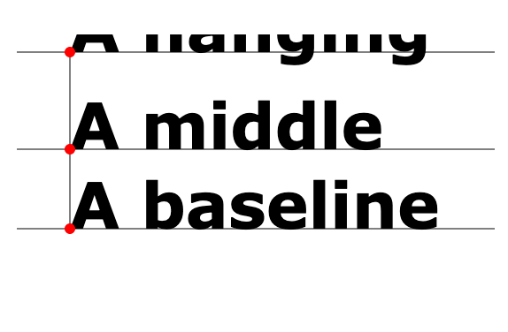
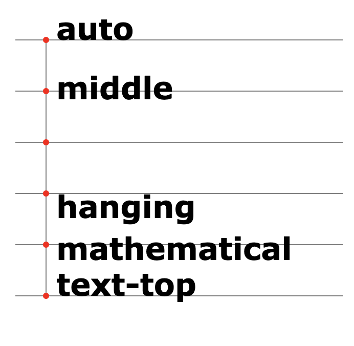
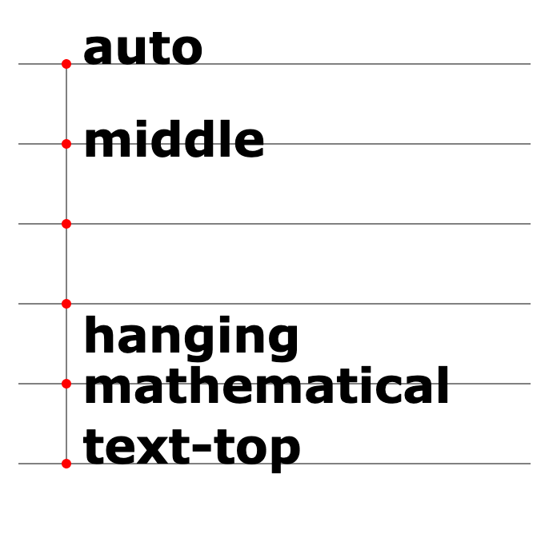
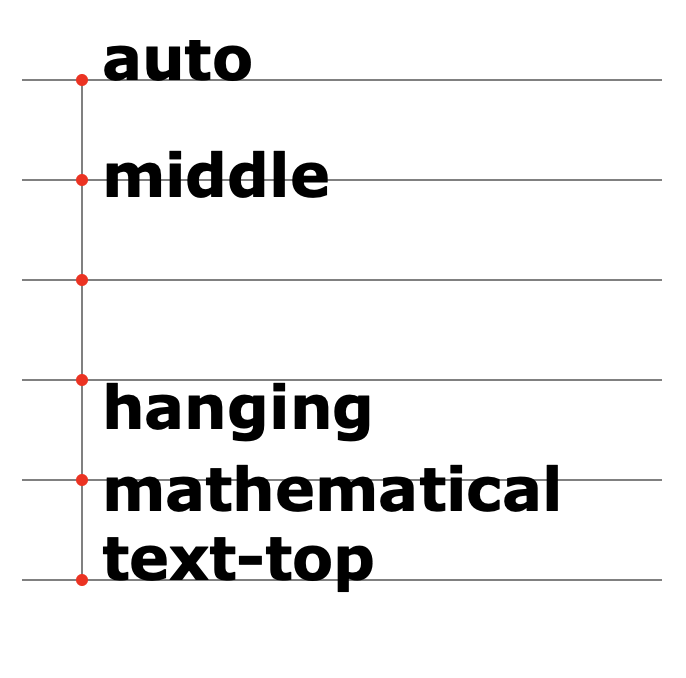
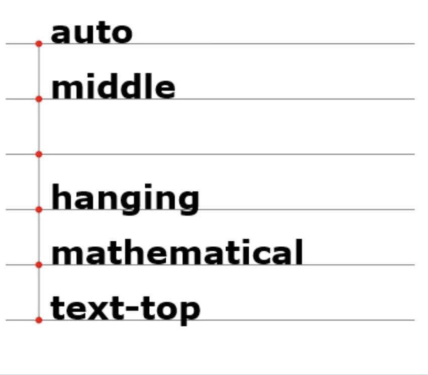

# Accurat Coding Styleguide

## Preamble

**The following rules are a general styleguide, but you should always prefer the project style if you have to work in an existant project. To state it differently: _Project style is more important than Accurat style._**

The following rules assume the knowledge of ES6-7-8 and its terminology.
If any of the words in the index of [this handbook](https://www.freecodecamp.org/news/the-react-handbook-b71c27b0a795/) (especially the first 4 sections) sound new to you, you should read something about it to fully understand the document in you hands.
For a quick reminder on some of the ES6 terminology, have a look at [http://es6-features.org/].

## JavaScript

###### Names
Be very careful when naming files, variables or functions: it's one of the most important things in software development.

###### File Naming
Name the file exactly as the main exported variable (the most important exported). Use CamelCase, avoid dash-casing. (open problem: "*-utils" files)
      WHY? Because it's easier to rename using the same convention for variables and files.

###### Variables Naming
 - Try to maintain the same name for the same entity or structure throughout the entire file.
 - The bigger is the scope in which a variable is used, the more explanative its name should be. You can use `d` if it's a one-line function, but in a 100 lines function you should explain a little more what that variable contains, such as: `filteredUniqueDatasetGroupedByCountry`.
  - Prefer to name a variable containing a boolean to begin with prefix `has*` of `is*` like `const isVisible = condition1 && condition2`, or `const hasChildren = children.length > 0`. Or `isOpen` instead of `open`, use `open` for the action which sets `isOpen = true`.
      WHY? More readable, and can be read as plain english: `if (isOpen) { close() }`
  - For a variable containing a count (integer) prefer a name ending with `*Count`. This is not so obvious, since anyone would be tempted to assign `const elements = 5`
      WHY? It's way more explicit to use `const elementsCount = 5`, since `elements` could be an array of elements.
  - Variables should NEVER be named `data`, please prefer `dataset` for collections and `datum` for a single row / element.
      WHY? The word `data` express no plurality or singularity, and gives absolutely no hints about the content. For example use: `productsDataset` `filteredTimelineDataset` and so on
      NB: This should ONLY be used for real data, as in Accurat's Data. Not for configuration objects or information, for which other names should be used.

###### Modules
 - Keep your imports in order! A neat and tidy block of imports keeps the file ordered. (Alphabetical ordering is too much)
 - Do not ever `export default` (unless is somehow needed like in `pages` folder in Next.js) but ALWAYS export named function, const, class or component
     WHY? It helps naming coherence (you import the exact name of what you export and it increase readability), and it helps tree shaking.

###### Other
 - When you access more nested properties, do it at once with [destructuring](https://developer.mozilla.org/en-US/docs/Web/JavaScript/Reference/Operators/Destructuring_assignment) and never repeat it more times.
BAD: `this.props.dataset[0]` and then `this.props.color` and then `this.props.asd.foo.bar`
GOOD: `const { dataset, color, asd } = this.props; const bar = asd.foo.bar; const first = dataset[0]`
    WHY? Who reads the code can immediately see what is extracted from the class/object to be used in the method.

## React Components

  - Do not mix [Function Components]() with [Class Components]() in the same project. Use the one your project was started with.
    WHY? Codebase coherence.
  - Class components should have ALL their JSX contained in the `render()` method. No other method returning JSX (= render method) should exist, such as `renderSection()` or similar. If you spot one, that will be a code smell and you should suggest it to be refactored.
      WHY? So that everyone knows where to look. If you feel the need for a render method, that should be a new component! (It also improves performance, because it has logic on whether to re-render itself)
  - Function components should use the named function style (`function App() {}`) instead of the anonymous function style (`const App = () => {}`).
      WHY? Having a named function helps when debugging, especially with the React Devtools
  - Listeners props on new components should always be called with the `on`: onClick, onHover, onPress.
      WHY? Makes the code obvious.
  - If you create a function returning a function to be used as listener, please call it in a way that makes the reader understand it: `build*`, `make*`, `create*`. Example: `buildSelect = (family) => (event) => { select(family) }`
      WHY? To differentiate listeners from listeners builders, which return functions to be used as listeners.
  - Icon components should end with "*Icon", and similar.
      WHY? Think about the name in its context and scope: does it make sense to be called "Search", or should it be "SearchIcon"?

## State:
  - The root MobX state should have no actions and no views, only properties containing other models.
      WHY? This separates concerns in an otherwise irreversible way. If you create an action in the global state, you will regret it. (I did! – @caesarsol)
  - The models should never be nested more than one level. Always keep models at the root level.
    WHY? It keeps the project maintainable as you could easily end up with some unmanageable 5 level deep models. It’s easier to access the model from the root, with `const { timeline } = getRoot(self)` in MST, and `const { timeline } = this.props.state` in React
  - [Action](https://github.com/mobxjs/mobx-state-tree#actions) names should be grammatical verbes
      WHY? Actions perform a modification, and return nothing.
  - [Views](https://github.com/mobxjs/mobx-state-tree#views) names should be grammatical names. BAD: `get filterValues() { … }` GOOD: `get filteredValues() { … }`
      WHY? They represent values.
  - [Computed Values](https://github.com/mobxjs/mobx-state-tree#views) (= [getter](https://developer.mozilla.org/en-US/docs/Web/JavaScript/Reference/Functions/get) views) names should not start with `get`, only view functions can. BAD: `get getUserList() { … }` GOOD: `get userList() { … }`
      WHY? Getters should be indistinguishable from state properties, so that you can later refactor your code and switch between them without the need to update the components using them. Moreover, they are automatically cached/updated so it makes no sense to use a verb inside, since they do not "perform" any action.
  - If MST is interrogating some APIs, each model should not do more than 1 api request. There should be one `load()` action which makes the request and saves the request in a property of the model. The data computation should be done in the getters or on server-side.
    WHY? There is more consistency across the project and the data flow is more manageable.
  - If MST is interrogating some APIs, make sure to call the `load()` method from a react component’s `constructor` or `componentDidMount`, not from an `afterCreate()` of the state.
    WHY? It leads to less issues if you have multiple routes and some state shared between those
  - If MST is interrogating some APIs, make sure to create a `reset()` action alongside the `load()` action. It should be called in the react component in the `constructor`, before the `load()` call. A reset action looks like this
      ```
      reset() {
        applySnapshot(self, {})
      },
      ```
      WHY? It leads to less issues if you have multiple routes, for example a login page.
  - In the models with some array data, avoid at all costs using `.find()` in the getters. Use indexed objects instead. Here is a simple example:
      ```
      get datasetById() {
        return keyBy(self.dataset, 'id')
      },
      ```
      Then use: `self.datasetById[id]` instead of `self.dataset.find(x => x.id === id)`
      WHY? It could lead to some performance issues in the long run as the data magnitude increases


## TypeScript:

  - Any defined **type** should be TitleCased
  - When defining types for something that is not a type try to use the same name (even if Vito thinks that it should be illegal (cit.))
   WHY? The TypeScript compiler can discern this information for itself and having `FooType` and `FooModel` is just noisy when you master the difference between what is a type and what is not.

## TypeScript and React:

  - For [Function Components](https://medium.com/@ethan_ikt/react-stateless-functional-component-with-typescript-ce5043466011) always use the type `React.FunctionComponent<Props>`, don’t try to rewrite the type.
      WHY? Don’t try to type `children` in a correct way: it’s hard and it can change between releases of @types/react.
  - Always declare `type Props` and `type State` of a component in a standalone type (not inline) and with the simplest name possible:
```ts
// BAD
class MyComponent extends React.Component<{
 myProp: number
}> { … }

// GOOD
type Props = { myProp: number }
class MyComponent extends React.Component<Props> { … }
```

## Folders
TODO (what components go into components, which into ui, the lib folder (!!!), the locale folder, the constants file, API file)

## CSS
TODO

## Commit naming
TODO
- https://chris.beams.io/posts/git-commit/
- emojis

## Workflow

TODO: Detail this

Prettier - editor config - format on save
Eslint - editor config
Editor - Ensure Newline at end of file / No trailing spaces everywhere (superseded by prettier)
Git pull with rebase
Git up snippet
merge.conflictstyle diff3
master as most updated branch
tags for production deploys
Push your branch ASAP, even if it's not ready for merge. Every end of the day for example.
OSX: show dotfiles and hidden files command: defaults write com.apple.finder AppleShowAllFiles -bool true

## Browser compatibility

This is a list of issues arising from cross-browser development we've learned throught the years. When developing, keep in mind the compatibility your application need to have (hopefully IE is out of the mix, but doublecheck it). The perfect philosophy is to avoid anything that could give problems, especially if it can be done in other ways.

### JavaScript

#### [`Element.getBoundingClientRect()`](https://developer.mozilla.org/en-US/docs/Web/API/Element/getBoundingClientRect)

Usually it returns a `DOMRect` object which is the union of the rectangles returned by `getClientRects()` for the element, i.e., the CSS border-boxes associated with the element.
The result is the smallest rectangle which contains the entire element, with read-only `left`, `top`, `right`, `bottom`, `x`, `y`, `width`, and `height` properties describing the overall border-box in pixels. Properties other than `width` and `height` are relative to the top-left of the viewport.

##### Issues

- **IE 9, 10, 11**
  - The returned object lacks `x` & `y` values, use `left` instead of `x` and `top` instead of `y`.
- **IE 8**
  - The returned object lacks `width` and `height` properties.
  - The returned object lacks `x` & `y` values, use `left` instead of `x` and `top` instead of `y`.
- **IE 6, 7**
  - The returned object lacks `width` and `height` properties.

### SVG

#### [`alignment-baseline`](https://developer.mozilla.org/en-US/docs/Web/SVG/Attribute/alignment-baseline)

The `alignment-baseline` attribute specifies how an object is aligned with respect to its parent. This property specifies which baseline of this element is to be aligned with the corresponding baseline of the parent.

| Chrome                                            | Firefox                                             | Safari                                            | IE11                                      |
| ------------------------------------------------- | --------------------------------------------------- | ------------------------------------------------- | ----------------------------------------- |
|  |  |  |  |

Then it's better to use  `dominant-baseline`.

#### [`dominant-baseline`](https://developer.mozilla.org/en-US/docs/Web/SVG/Attribute/dominant-baseline)

The `alignment-baseline` attribute specifies the dominant baseline, which is the baseline used to align the box’s text and inline-level contents. It also indicates the default alignment baseline of any boxes participating in baseline alignment in the box’s alignment context.

| Chrome                                           | Firefox                                            | Safari                                           | IE11                                     |
| ------------------------------------------------ | -------------------------------------------------- | ------------------------------------------------ | ---------------------------------------- |
|  |  |  |  |

If you need to support also IE, then use `dy` instead of `dominant-baseline`.

## `foregnObject`

- In Safari, nei div dentro a un `foregnObject` sembra che se si applica un'opacità essi vengono spostati a `x=0` (???)

  _soluzione/workaround_: usare colore anzichè opacità

- In Safari, in un `foreignObject` qualunque elemento con `position: absolute` dà problemi, trattando come origine non quella del `foreignObject` ma quella dell'elemento SVG.

  _soluzione/workaround_: inserire nel `foreignObject` un div in position fixed, allineare il `foreignObject` alla `y=0` e muoverlo verticalmente con un translate

- In Safari, in un `foreignObject` dentro a un `<g>` che abbia un `translate`, la `x` non viene applicata.

  _soluzione/workaround_: inserire nel `foreignObject` un `div` in position `fixed`

## `transform`

Piccola incoerenza che i browser trattano diversamente (Firefox e Chrome tolleranti, Safari più strict):
- in SVG si fa: `<g transform="translate(10, 10)">` mentre in HTML: `<div style="transform: translate(10px, 10px)">`
- in SVG si fa: `.attr('transform', 'translate(10, 10)')` mentre in HTML: `.style('transform', 'translate(10px, 10px)')`
NOTA BENE: un `<svg>` è un elemento HTML, non SVG